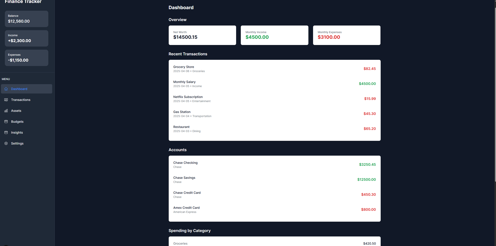
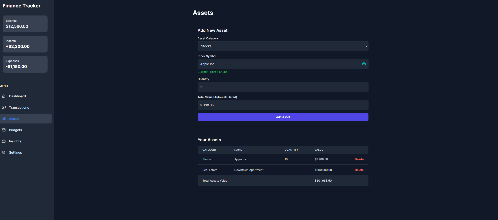
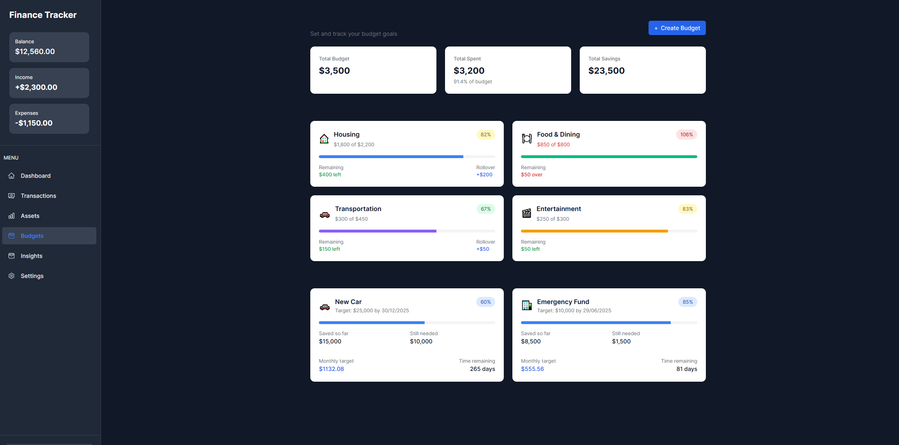
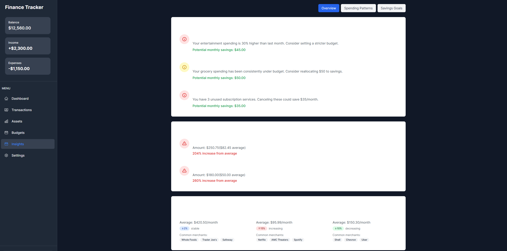
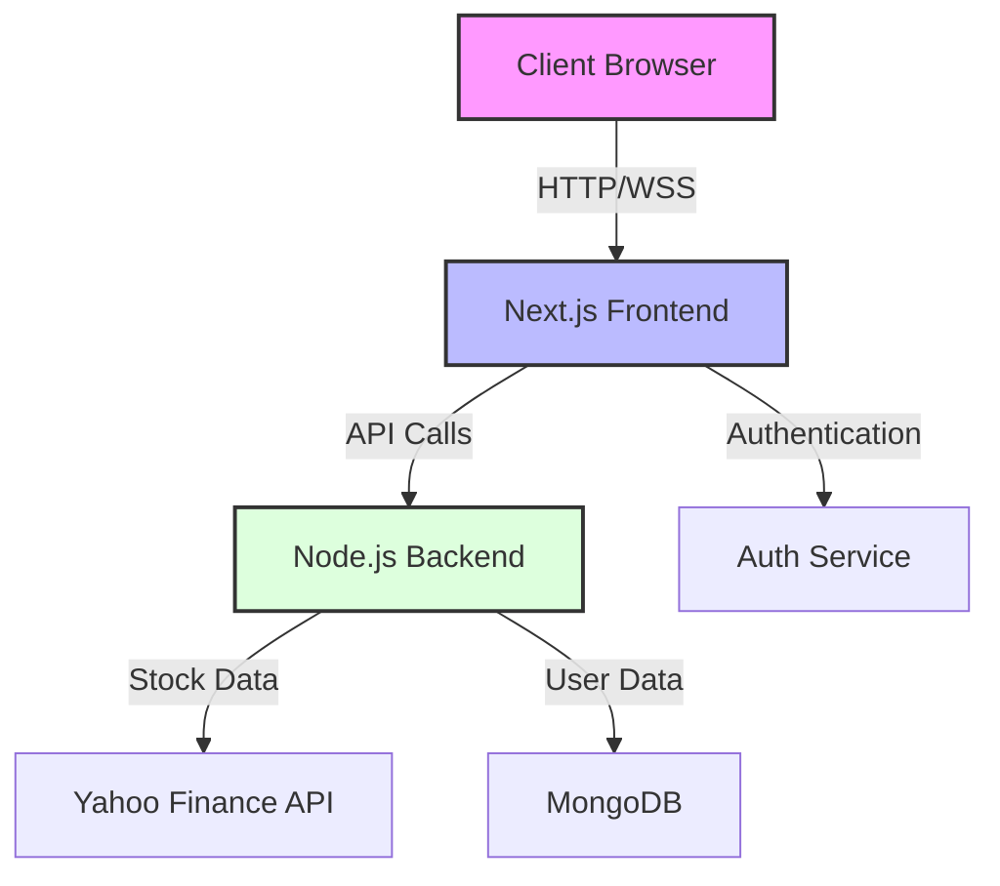

# Personal Finance Tracker

A comprehensive full-stack financial management application built with modern web technologies. This application helps users track their assets, monitor investments, and manage their personal finances with real-time market data integration.

## 📸 Application Screenshots

### Dashboard & Financial Overview

*Main dashboard providing a comprehensive view of your financial status*

### Asset Management

*Track and manage various assets including stocks with real-time market data*

### Budget Planning

*Set and monitor budgets across different categories*

### Financial Insights

*Data-driven insights to help make informed financial decisions*

## 🏗 System Architecture



## Technical Overview

### Architecture
- **Frontend**: Next.js 15.2 with TypeScript
- **Backend**: Node.js with Express
- **Styling**: Tailwind CSS for responsive design
- **State Management**: React Hooks and Context API
- **API Integration**: Real-time stock data via Yahoo Finance API

### Key Features Implemented

#### 1. Asset Management System
- **Multi-Asset Support**: Track various asset types including:
  - Stocks (with real-time price updates)
  - Real Estate
  - Watches/Jewelry
  - Vehicles
  - Other valuable assets
- **Real-Time Stock Integration**:
  - Automatic price fetching from Yahoo Finance
  - Live calculation of portfolio values
  - Smart debouncing for API calls
  - Server-side API route implementation for security

#### 2. User Interface
- **Responsive Design**: Full mobile and desktop support
- **Dark Theme**: Modern dark mode implementation
- **Interactive Components**:
  - Dynamic asset forms with contextual fields
  - Real-time validation and feedback
  - Automatic value calculations
- **Dashboard Layout**: Intuitive navigation with sidebar

#### 3. Technical Implementation Highlights
- **Server-Side Rendering**: Next.js SSR with hydration optimization
- **Type Safety**: Full TypeScript implementation
- **API Architecture**: RESTful API design with proper error handling
- **Security Features**:
  - Environment variable management
  - API key protection
  - Secure data handling

### Development Practices
- **Version Control**: Git with structured commit messages
- **Code Organization**: Component-based architecture
- **Security**: Proper environment variable handling and API security
- **Documentation**: Comprehensive inline documentation and README

## Future Enhancements (In Progress)
1. User Authentication System
2. Transaction Management
3. Budget Tracking
4. Data Visualization
5. Bank Account Integration

## Technical Skills Demonstrated
- Modern React Development (Hooks, Context, SSR)
- TypeScript & Type Safety
- API Integration & Real-time Data Handling
- Responsive Web Design
- Security Best Practices
- Full-Stack Development
- Version Control & Project Organization

## Getting Started

### Prerequisites
- Node.js (v18+)
- npm or yarn
- Git

### Installation
```bash
# Clone the repository
git clone [repository-url]

# Install dependencies
cd personal-finance-tracker
npm install

# Set up environment variables
cp .env.example .env.local

# Start the development server
npm run dev
```

### Environment Setup
Configure the following environment variables in `.env.local`:
- API endpoints
- External service configurations
- Development mode settings

## Project Structure
```
personal-finance-tracker/
├── frontend/                # Next.js frontend
│   ├── src/
│   │   ├── app/           # Pages & API routes
│   │   ├── components/    # React components
│   │   ├── services/      # External services
│   │   └── types/        # TypeScript definitions
├── backend/                # Node.js backend
│   └── src/
└── docs/                  # Documentation
```

## 🌟 Features

### Core Features
- Bank account integration via Teller API
- Transaction tracking and categorization
- Budget management
- Debt tracking
- Net worth monitoring
- Predictive financial insights

### Analytics & Visualizations
- Interactive dashboards
- Spending pattern analysis
- Budget vs. actual comparisons
- Debt payoff projections
- Savings goal tracking
- Custom financial reports

## 🏗 Project Structure

```
personal-finance-tracker/
├── frontend/                # Next.js frontend application
│   ├── components/         # Reusable UI components
│   ├── pages/             # Application pages
│   ├── public/            # Static assets
│   └── styles/            # CSS and styling
├── backend/                # Node.js backend server
│   ├── controllers/       # Request handlers
│   ├── models/           # Database models
│   ├── routes/           # API routes
│   └── services/         # Business logic
└── docs/                  # Documentation
    ├── mockups/          # UI mockups
    └── api/              # API documentation
```

## 🚀 Development Roadmap

### Day 1: Setup & Basic Structure
- [ ] Project initialization
- [ ] Environment setup
- [ ] Basic frontend structure
- [ ] User authentication system
- [ ] Database schema design

### Day 2: Teller Integration
- [ ] Teller API integration
- [ ] Bank account connection flow
- [ ] Initial transaction fetching
- [ ] Basic data storage

### Day 3: Core Features
- [ ] Transaction categorization
- [ ] Account balance tracking
- [ ] Basic dashboard
- [ ] Net worth calculation

### Day 4: Advanced Features
- [ ] Debt tracking system
- [ ] Expense analytics
- [ ] Budget tracking
- [ ] Transaction history views

### Day 5: Predictive Features
- [ ] Spending pattern analysis
- [ ] Budget recommendations
- [ ] Expense forecasting
- [ ] Savings projections

### Day 6: UI/UX & Polish
- [ ] UI refinement
- [ ] Mobile responsiveness
- [ ] Performance optimization
- [ ] Error handling improvements

### Day 7: Testing & Deployment
- [ ] End-to-end testing
- [ ] Bug fixes
- [ ] Documentation
- [ ] Production deployment

## 🛠 Technical Stack

### Frontend
- Next.js (React)
- Tailwind CSS
- Chart.js/D3.js for analytics
- WebSocket for real-time updates

### Backend
- Node.js
- Express.js
- MongoDB
- Teller API

### Authentication & Security
- Auth0/NextAuth
- JWT tokens
- HTTPS encryption

### Deployment
- Vercel (frontend)
- Railway/Heroku (backend)
- MongoDB Atlas (database)

## 📊 Database Schema

### Users
```sql
User {
  id: ObjectId
  email: String
  name: String
  preferences: Object
  settings: Object
  createdAt: DateTime
  updatedAt: DateTime
}
```

### Accounts
```sql
Account {
  id: ObjectId
  userId: ObjectId
  tellerId: String
  type: String
  name: String
  balance: Number
  currency: String
  lastSync: DateTime
}
```

### Transactions
```sql
Transaction {
  id: ObjectId
  accountId: ObjectId
  tellerId: String
  amount: Number
  category: String
  description: String
  date: DateTime
  type: String
  tags: Array
}
```

### Budgets
```sql
Budget {
  id: ObjectId
  userId: ObjectId
  category: String
  amount: Number
  period: String
  startDate: DateTime
  endDate: DateTime
  alerts: Array
}
```

## 📱 UI Mockups

See detailed mockups in [docs/mockups/UI_MOCKUPS.md](docs/mockups/UI_MOCKUPS.md)

## 📈 Analytics Features

### Visualization Types
- Net Worth Trend (Area Chart)
- Spending by Category (Pie/Donut Chart)
- Budget Progress (Bar Charts)
- Debt Payoff Timeline (Line Chart)
- Savings Goals Progress (Gauge Charts)
- Cash Flow Analysis (Waterfall Chart)

### Predictive Analytics
- Spending pattern detection
- Budget recommendations
- Expense anomaly detection
- Savings opportunity identification
- Custom financial health score

## 🔒 Security Features

- End-to-end encryption
- Secure bank connection via Teller
- Two-factor authentication
- Regular security audits
- GDPR compliance
- Data backup and recovery

## 📦 Installation

```bash
# Clone the repository
git clone https://github.com/MJCFL/personal-finance-tracker.git

# Install dependencies
cd personal-finance-tracker
npm install

# Set up environment variables
cp .env.example .env

# Run development server
npm run dev
```

## 🤝 Contributing

Contributions are welcome! Please read our Contributing Guide for details on our code of conduct and the process for submitting pull requests.

## 📄 License

This project is licensed under the MIT License - see the [LICENSE](LICENSE) file for details.
