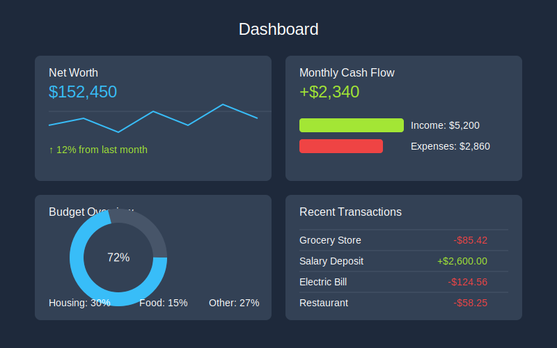
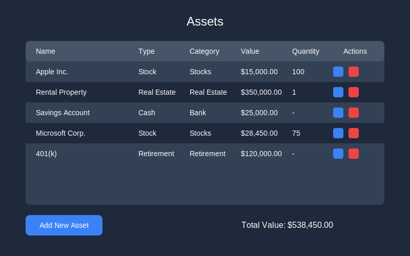
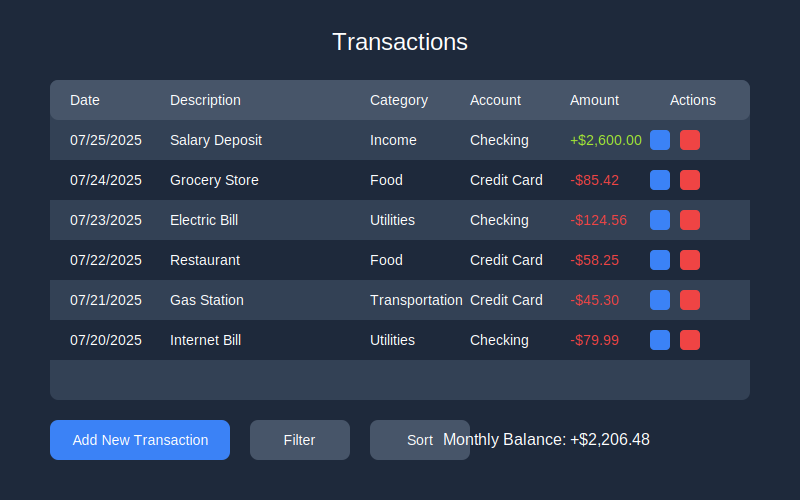
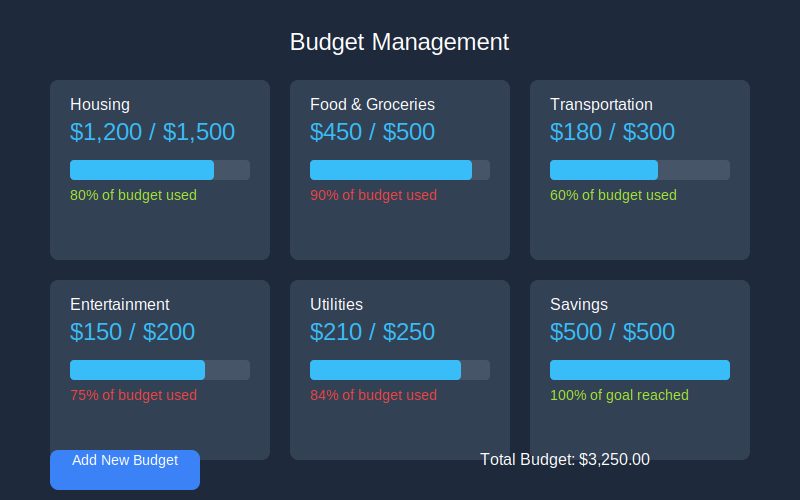
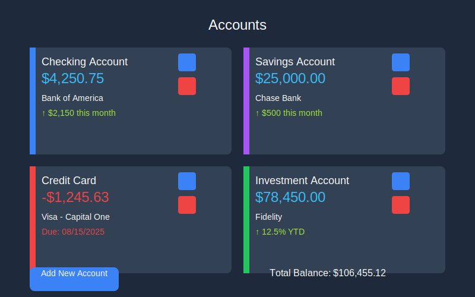
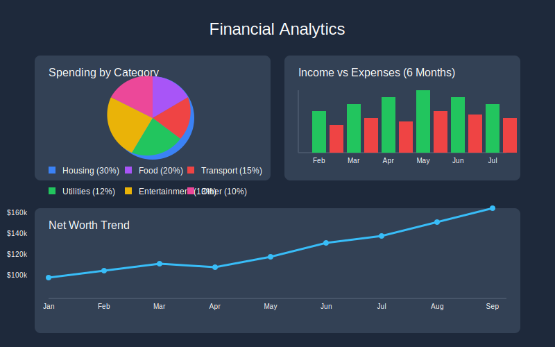

# Personal Finance Tracker
## Project Overview & Implementation

---

## Table of Contents

1. Project Overview
2. Technologies Used
3. Key Features
4. Implementation Process
5. Architecture
6. User Experience
7. Future Enhancements
8. Demo & Questions

---

## Project Overview

- **Goal**: Create a comprehensive personal finance management application
- **Purpose**: Help users track assets, transactions, budgets, and financial goals
- **Target Users**: Individuals seeking to improve financial management
- **Key Value**: Consolidated view of financial health with intuitive visualizations

---

## Technologies Used

- **Frontend**: Next.js, React, TypeScript, Tailwind CSS
- **Backend**: Next.js API Routes
- **Database**: MongoDB Atlas
- **Authentication**: NextAuth.js with Google OAuth
- **Data Visualization**: Recharts
- **Deployment**: Vercel-ready

---

## Key Features: Dashboard

- Comprehensive financial overview
- Net worth calculation
- Monthly cash flow visualization
- Recent transactions summary
- Budget completion status

---

## Key Features: Asset Management

- Track multiple asset types (stocks, real estate, cash)
- Real-time stock price updates
- Portfolio diversification view
- Asset performance tracking

---

## Key Features: Transaction Tracking

- Record and categorize all financial transactions
- Filter by date, category, or account
- Spending pattern analysis
- Income vs. expense breakdown

---

## Key Features: Budget Management

- Create budgets for different spending categories
- Visual progress tracking
- Monthly budget vs. actual comparisons
- Budget alerts and notifications

---

## Key Features: Account Management

- Connect and manage all financial accounts
- Track balances across institutions
- Account performance monitoring
- Transaction history by account

---

## Key Features: Analytics

- Spending by category visualization
- Income vs. expenses over time
- Net worth trend analysis
- Financial goal progress tracking

---

## Implementation Process

1. **Planning & Setup**
   - Requirements gathering
   - Technology selection
   - Project structure establishment

2. **Core Functionality**
   - Asset management implementation
   - MongoDB integration
   - API route development

---

## Implementation Process (cont.)

3. **User Authentication**
   - Google OAuth integration
   - User session management
   - Protected routes implementation

4. **Data Management**
   - User-specific data scoping
   - Transaction and account models
   - Budget tracking system

---

## Implementation Process (cont.)

5. **UI/UX Refinement**
   - Responsive design implementation
   - Visual walkthrough creation
   - Accessibility improvements

6. **Production Readiness**
   - Security enhancements
   - Performance optimization
   - Deployment preparation

---

## Architecture

- **Frontend**: React components with Next.js pages
- **API Layer**: Next.js API routes for data operations
- **Authentication**: NextAuth.js middleware for route protection
- **Database**: MongoDB collections for users, assets, accounts, transactions, and budgets
- **State Management**: React Context API for global state

---

## User Experience

- **Onboarding**: Visual walkthrough of features
- **Navigation**: Intuitive sidebar for easy access to all sections
- **Responsiveness**: Fully responsive design for all devices
- **Feedback**: Success/error messages for all user actions
- **Help**: Contextual help available throughout the application

---

## Future Enhancements

- **Financial Goals**: Set and track specific financial goals
- **Investment Analysis**: Detailed investment performance tracking
- **Tax Planning**: Tax liability estimation and planning tools
- **Financial Education**: Resources for improving financial literacy
- **Mobile App**: Native mobile application for on-the-go access

---

## Thank You!

### Questions & Demo

Personal Finance Tracker: A comprehensive solution for managing your financial life
